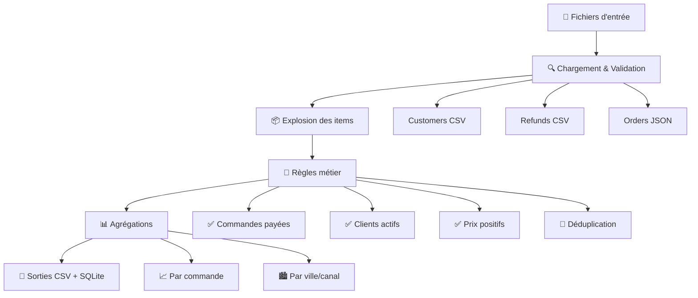

# 📊 Partie 2 : Mini-pipeline de traitement des données FreshKart

## 🎯 Vue d'ensemble

Ce pipeline transforme les données brutes de FreshKart (commandes, clients, remboursements) en rapports quotidiens de ventes agrégées par ville et canal de distribution. Il s'agit d'un **ETL (Extract, Transform, Load)** simplifié qui automatise le processus de nettoyage et d'agrégation des données.

---

## 📁 Architecture des données

### 📥 **Données d'entrée** (`data/input/`)

| Fichier                  | Description                 | Colonnes clés                        |
| ------------------------ | --------------------------- | ------------------------------------ |
| `customers.csv`          | Référentiel clients         | `customer_id`, `is_active`, `city`   |
| `refunds.csv`            | Remboursements par commande | `order_id`, `amount` ou `amount_eur` |
| `orders_YYYY-MM-DD.json` | Commandes du jour           | `order_id`, `customer_id`, `items[]` |

### 📤 **Données de sortie** (`Partie_2/output/`)

| Fichier                       | Description      | Contenu                         |
| ----------------------------- | ---------------- | ------------------------------- |
| `daily_summary_YYYYMMDD.csv`  | Résumé quotidien | Ventes par ville/canal          |
| `sales.db`                    | Base SQLite      | Données nettoyées + agrégations |
| `rejected_items_YYYYMMDD.csv` | Audit            | Articles rejetés (optionnel)    |

---

## 🔄 Flux de traitement



---

## ⚙️ Fonctions principales

### 🔧 **1. Chargement des données**

```python
def load_customers(customers_path: Path) -> pd.DataFrame:
    """Charge et valide le fichier clients"""
    # ✅ Vérifie : customer_id, is_active, city

def load_refunds(refunds_path: Path) -> pd.DataFrame:
    """Charge et normalise les remboursements"""
    # 💰 Convertit en montants négatifs
    # 📊 Agrège par order_id

def load_orders_json(orders_path: Path) -> pd.DataFrame:
    """Parse le JSON des commandes"""
    # 📅 Normalise les dates (order_date ou created_at)
    # 📦 Prépare l'explosion des items
```

### 🔀 **2. Transformation des données**

```python
def explode_items(orders_df: pd.DataFrame) -> pd.DataFrame:
    """Développe les items en lignes séparées"""
    # AVANT: 1 commande → 1 ligne avec liste d'items
    # APRÈS: 1 commande → N lignes (1 par item)
```

**Exemple de transformation :**

| order_id | items                                                              |
| -------- | ------------------------------------------------------------------ |
| 123      | `[{"sku":"A","qty":2,"price":10}, {"sku":"B","qty":1,"price":15}]` |

↓ **explode_items()**

| order_id | item_sku | item_quantity | item_unit_price |
| -------- | -------- | ------------- | --------------- |
| 123      | A        | 2             | 10.0            |
| 123      | B        | 1             | 15.0            |

### 🎯 **3. Règles métier**

```python
def apply_business_rules(orders_items_df, customers_df):
    """Applique les filtres de qualité des données"""
```

#### 📋 **Filtres appliqués :**

| Règle                   | Description                | Impact                              |
| ----------------------- | -------------------------- | ----------------------------------- |
| 💳 **Commandes payées** | `payment_status == "paid"` | Exclut les commandes non finalisées |
| 👥 **Clients actifs**   | `is_active == True`        | Focus sur la clientèle active       |
| 💰 **Prix positifs**    | `item_unit_price >= 0`     | Rejette les données incohérentes    |
| 🔄 **Déduplication**    | Premier `order_id`         | Évite les doublons                  |

### 📊 **4. Agrégations**

#### **Niveau commande :**

```python
def aggregate_orders(cleaned_items_df, refunds_by_order):
    """Calcule les métriques par commande"""
    # ➕ Somme des quantités et montants
    # ➖ Intègre les remboursements
    # 💰 Revenu net = Brut + Remboursements
```

#### **Niveau ville/canal :**

```python
def build_daily_city_sales(per_order):
    """Agrège par date, ville et canal"""
    # 🏙️ Groupe par ville
    # 📱 Sépare app vs web
    # 📈 Calcule les KPI business
```

---

## 📈 Métriques calculées

### 🏷️ **Définitions des KPI**

| Métrique              | Description         | Formule                        |
| --------------------- | ------------------- | ------------------------------ |
| **orders_count**      | Nombre de commandes | `COUNT(DISTINCT order_id)`     |
| **unique_customers**  | Clients uniques     | `COUNT(DISTINCT customer_id)`  |
| **items_sold**        | Articles vendus     | `SUM(item_quantity)`           |
| **gross_revenue_eur** | Revenu brut         | `SUM(quantity × unit_price)`   |
| **refunds_eur**       | Remboursements      | `SUM(refund_amount)` (négatif) |
| **net_revenue_eur**   | Revenu net          | `gross_revenue + refunds`      |

### 📊 **Exemple de résultats**

```csv
date;city;channel;orders_count;unique_customers;items_sold;gross_revenue_eur;refunds_eur;net_revenue_eur
2025-03-15;Bordeaux;app;8;8;70;816.9;-39.05;777.85
2025-03-15;Bordeaux;web;6;6;50;479.7;-45.62;434.08
2025-03-15;Lille;app;9;9;88;992.0;-53.74;938.26
```

**Interprétation :**

-   **Bordeaux app** : 8 commandes, 70 articles, 777.85€ net
-   **Bordeaux web** : 6 commandes, 50 articles, 434.08€ net
-   **Lille app** : Meilleure performance (938.26€ net)

---

## 🚀 Utilisation

### 📋 **Prérequis**

```bash
# Installation des dépendances
pip install -r requirements.txt
```

### 💻 **Exécution**

```bash
# 🎯 Exécution simple (date par défaut: 2025-03-15)
python run_pipeline.py

# ⚙️ Exécution avec paramètres personnalisés
python run_pipeline.py \
    --date 2025-03-16 \
    --input-dir data/input \
    --output-dir Partie_2/output

# 📚 Aide
python run_pipeline.py --help
```

### 🔧 **Paramètres configurables**

| Paramètre      | Défaut            | Description                   |
| -------------- | ----------------- | ----------------------------- |
| `--date`       | `2025-03-15`      | Date cible (YYYY-MM-DD)       |
| `--input-dir`  | `data/input`      | Dossier des fichiers d'entrée |
| `--output-dir` | `Partie_2/output` | Dossier de sortie             |

---

## 🗄️ Structure de la base SQLite

### 📊 **Tables créées**

#### **`orders_clean`** - Données détaillées par commande

```sql
CREATE TABLE orders_clean (
    order_id INTEGER,
    customer_id INTEGER,
    channel TEXT,
    city TEXT,
    order_date TEXT,
    items_sold REAL,
    gross_revenue_eur REAL,
    refunds_eur REAL,
    net_revenue_eur REAL
);
```

#### **`daily_city_sales`** - Agrégations quotidiennes

```sql
CREATE TABLE daily_city_sales (
    date TEXT,
    city TEXT,
    channel TEXT,
    orders_count INTEGER,
    unique_customers INTEGER,
    items_sold REAL,
    gross_revenue_eur REAL,
    refunds_eur REAL,
    net_revenue_eur REAL
);
```

---

## 🔍 Gestion de la qualité des données

### ⚠️ **Validation des entrées**

| Fichier         | Contrôles                                                                |
| --------------- | ------------------------------------------------------------------------ |
| `customers.csv` | Colonnes obligatoires : `customer_id`, `is_active`, `city`               |
| `refunds.csv`   | Colonnes : `order_id` + (`amount` ou `amount_eur`)                       |
| `orders_*.json` | Champs : `order_id`, `customer_id`, `payment_status`, `channel`, `items` |

### 🚫 **Articles rejetés**

Les articles avec **prix unitaire négatif** sont automatiquement rejetés et sauvegardés dans `rejected_items_YYYYMMDD.csv` pour audit.

### 📊 **Exemple de rejets**

```csv
order_id;customer_id;payment_status;channel;item_sku;item_quantity;item_unit_price
456;789;paid;web;PROD_ERROR;-5.0;10.0
```

---

## 🎯 Cas d'usage métier

### 📈 **Analyses possibles**

1. **Performance par canal** : App vs Web
2. **Géographie des ventes** : Performance par ville
3. **Impact des remboursements** : Analyse des retours
4. **Évolution temporelle** : Comparaison jour par jour

### 📊 **Exemples de requêtes SQL**

```sql
-- 🏆 Top 3 des villes par revenu net
SELECT city, SUM(net_revenue_eur) as total_revenue
FROM daily_city_sales
WHERE date = '2025-03-15'
GROUP BY city
ORDER BY total_revenue DESC
LIMIT 3;

-- 📱 Performance app vs web
SELECT channel,
       SUM(orders_count) as total_orders,
       SUM(net_revenue_eur) as total_revenue
FROM daily_city_sales
WHERE date = '2025-03-15'
GROUP BY channel;
```

---

## 🛠️ Architecture technique

### 🏗️ **Design patterns**

-   **ETL Pipeline** : Extract → Transform → Load
-   **Fonctions pures** : Chaque fonction a une responsabilité claire
-   **Validation en entrée** : Contrôles de qualité systématiques
-   **Gestion d'erreurs** : Messages explicites et arrêt propre

### 📦 **Dépendances**

```txt
pandas>=2.0,<3.0  # Manipulation de données
```

### 🔧 **Fonctions utilitaires**

| Fonction             | Rôle                                   |
| -------------------- | -------------------------------------- |
| `find_orders_file()` | Localise le fichier commandes par date |
| `parse_args()`       | Gestion des arguments CLI              |
| `write_outputs()`    | Sauvegarde CSV + SQLite                |

---

## 📝 Journal d'exécution

### ✅ **Exemple de sortie console**

```bash
$ python run_pipeline.py --date 2025-03-15

OK - Fini
```

### 📊 **Fichiers générés**

```
Partie_2/output/
├── daily_summary_20250315.csv    # 📈 Résumé quotidien
├── sales.db                      # 🗄️ Base SQLite
└── rejected_items_20250315.csv   # 🚫 Articles rejetés (si applicable)
```

---

## 🎓 Points d'apprentissage

### 🧠 **Concepts clés**

1. **ETL Pipeline** : Automatisation du traitement de données
2. **Normalisation JSON** : Transformation de structures imbriquées
3. **Agrégations pandas** : Calculs de KPI business
4. **Validation de données** : Contrôles de qualité
5. **Sorties multiples** : CSV + SQLite pour différents usages

### 🔍 **Bonnes pratiques appliquées**

-   ✅ **Séparation des responsabilités** : Une fonction = un rôle
-   ✅ **Validation en entrée** : Vérification des données
-   ✅ **Gestion d'erreurs** : Messages explicites
-   ✅ **Paramétrage** : Configuration flexible
-   ✅ **Documentation** : Code auto-documenté

---

## 🚀 Évolutions possibles

### 🔮 **Améliorations futures**

1. **Parallélisation** : Traitement multi-thread
2. **Monitoring** : Logs détaillés et métriques
3. **Tests unitaires** : Validation automatisée
4. **Configuration** : Fichier YAML pour les paramètres
5. **API REST** : Exposition des données via HTTP

### 📊 **Extensions métier**

1. **Prédictions** : Modèles de machine learning
2. **Alertes** : Notifications sur anomalies
3. **Dashboards** : Visualisations temps réel
4. **Exports** : Formats Excel, PDF, etc.

---

_Ce pipeline constitue une base solide pour l'analyse quotidienne des performances commerciales de FreshKart, avec une architecture modulaire et extensible._
